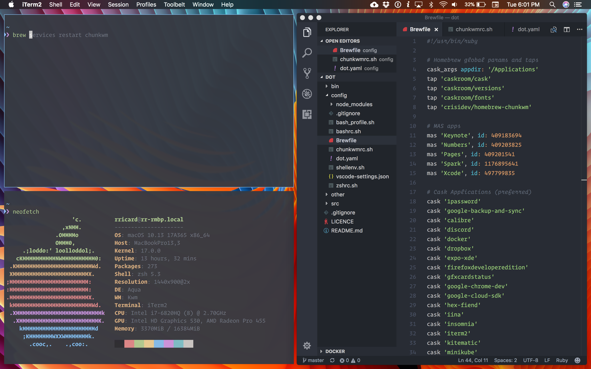

# dot

[Robin Ricard][rr]'s _dotfiles_ or user configuration for various CLI things + various macOS/app configuration.



## Install

Clone it, run the apply script for the first time:

```
git clone https://github.com/rricard/dot.git
cd dot
./bin/dotapply
```

## Make it yours

You may want to fork this repo for yourself in order to tweak it like you want it to be. Since dot will install [hub][hub] for you, forking is super easy:

```
git fork
```

## Apply changes

Once you changed some things in your config, you can apply them:

```
dotapply
```

You can automatically apply, commit and push the config by adding a commit message:

```
dotapply -m YOUR_COMMIT_MESSAGE -u YOUR_GH_USERNAME
```

You can also start an editor on the dot repo before applying anything, just use the -e option:

```
dotapply -e
Press ENTER to continue...
```

Press ENTER to resume the normal dotapply

This is useful if you want to install new stuff fast:

```
dotapply -e -m "Install a go environment"
```

Then, you can go to your brewfile and add the following for instance:

```ruby
brew 'go'
```

[rr]: http://rricard.me
[hub]: https://hub.github.com